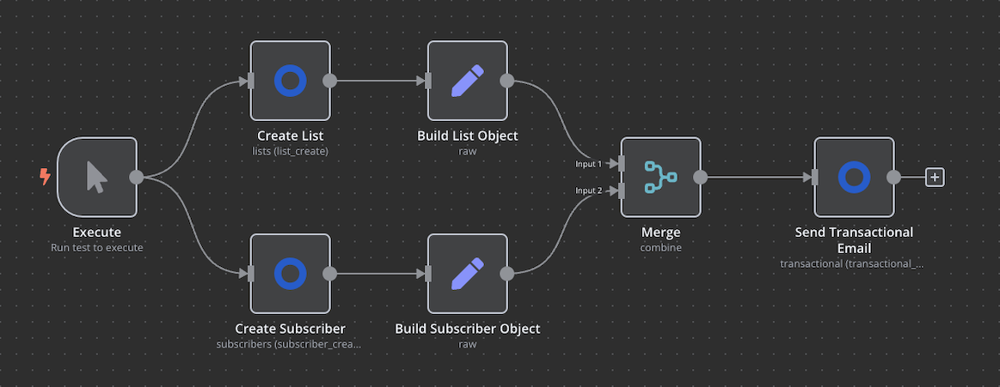

# n8n-nodes-listmonk-service

This is an n8n community node. It lets you use listmonk services in your n8n workflows.

**What is Listmonk?**  
Listmonk is an open source, self-host application which allow you to manage your subscribers and provides functions to send templated communications over email / sms etc.

[n8n](https://n8n.io/) is a [fair-code licensed](https://docs.n8n.io/reference/license/) workflow automation platform.

[Installation](#installation)  
[Operations](#operations)  
[Credentials](#credentials)
[Compatibility](#compatibility)  
[Resources](#resources)  

## Installation

Follow the [installation guide](https://docs.n8n.io/integrations/community-nodes/installation/) in the n8n community nodes documentation.

## Operations

There is only one node in this package capable of interacting with below resources and respective operations:

- Lists  
  - Create a list
  - Get a list _(by listID)_
  - Get all lists
  - Update a list _(by listID)_
  - Delete a list _(by listID)_
- Subscribers
  - Create a subscriber
  - Get a subscriber
  - Manage subscriber list
  - Update a subscriber
  - _more under implementation_
- Transactional
  - Send a transactional email

## Credentials

Listmonk uses basic auth so you will need to configure the credentials in the n8n. The credentials will be able to test the connectivity on save.

## Compatibility

This node is tested to run on a minimum version of n8n `v1.46.0`.

## Resources

* [n8n Community Nodes Documentation](https://docs.n8n.io/integrations/community-nodes/)
* [Listmonk API Documentation](https://listmonk.app/docs/apis/apis/)

